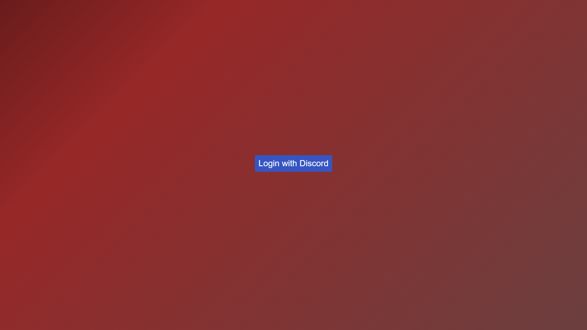
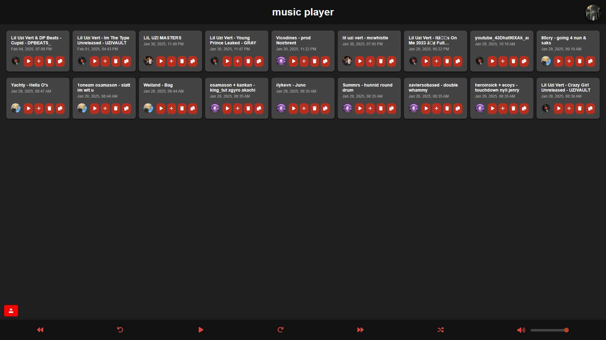
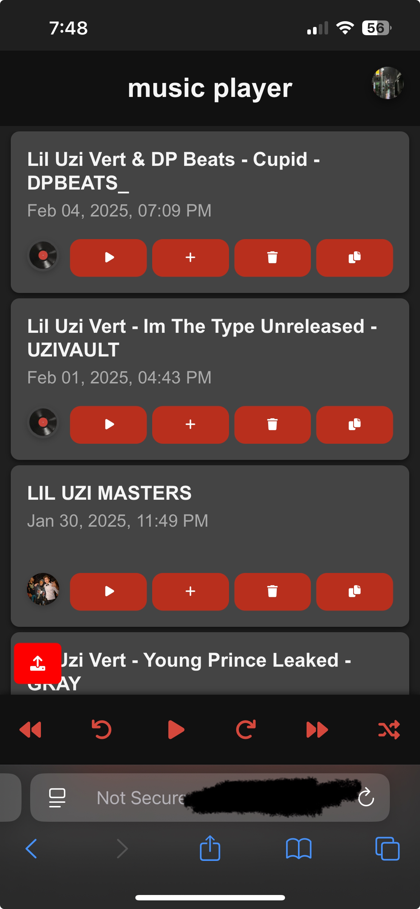
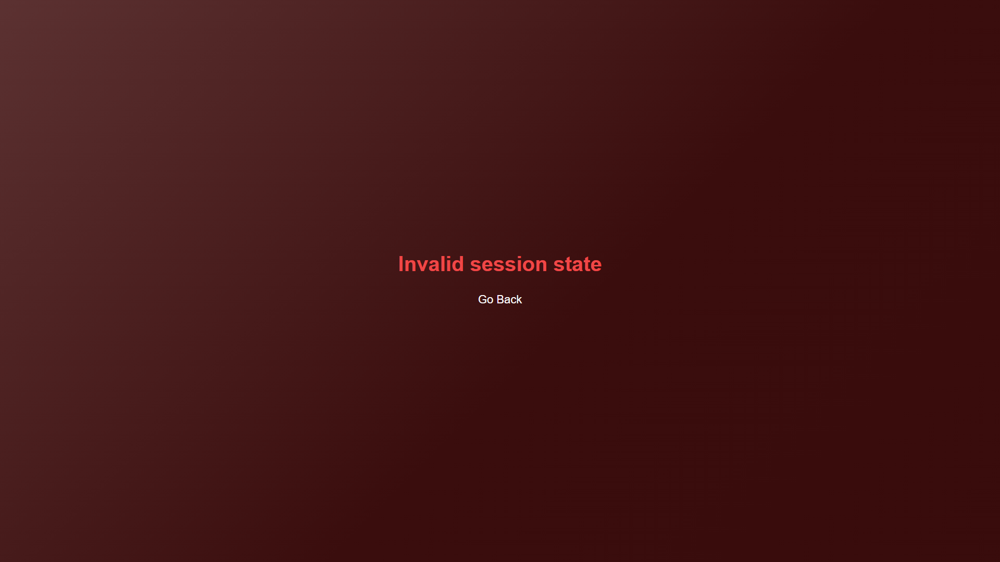

# music-player

a self-hosted application for storing & playing music easily. uses Discord OAuth.

- basic player controls (previous, last 10s, play, next 10s, next)
- song queue
- upload & delete tracks
- show song uploader via Discord avatar & name
- restrict access to a Discord Guild's members only

  
Screenshots

### Home:

### Player (PC):

### Player (Mobile):

### Error:

## Why

i don't really like paying for streaming services, especially for some of the music i listen to. this project was a nice way for me to share music between my phone & pc quickly and easy. plus, while on mobile, you can play music and leave the site without the music pausing. i created this within a little less than a week just for fun 😀

## Setup
1. Install [Git](https://git-scm.com/) (or [GitHub Desktop](https://desktop.github.com/download/)) and clone this repo
2. Install [Node.js](https://nodejs.org/) >= v16.14.0
3. Run `install.bat` inside folder to install dependencies
4. Create a new [Discord Application](https://discord.com/developers/applications).
5. Under the OAuth2 tab, add a new redirect of `https://your-domain.here/validate`.
6. Reverse proxy `http://localhost:port` to your (sub)domain with HTTPS.
7. Edit the `config.json.example` to be a valid `config.json`, and then setup your config like so

## Configuration

| Key             | Description                                                                          |
| --------------- | ------------------------------------------------------------------------------------ |
| clientId        | Your Discord Bot's Client ID.                                                        |
| clientSecret    | Your Discord Bot's Client Secret.                                                    |
| port            | The port to run this application on.                                                 |
| websiteUrl      | The URL of this site (if running IP:PORT, put in url).                               |
| jwtSecret       | Random characters, should never be modified.                                         |
| guildId         | The ID of the server to check if users are in.                                       |
| dev             | Enable development options                                                           |
